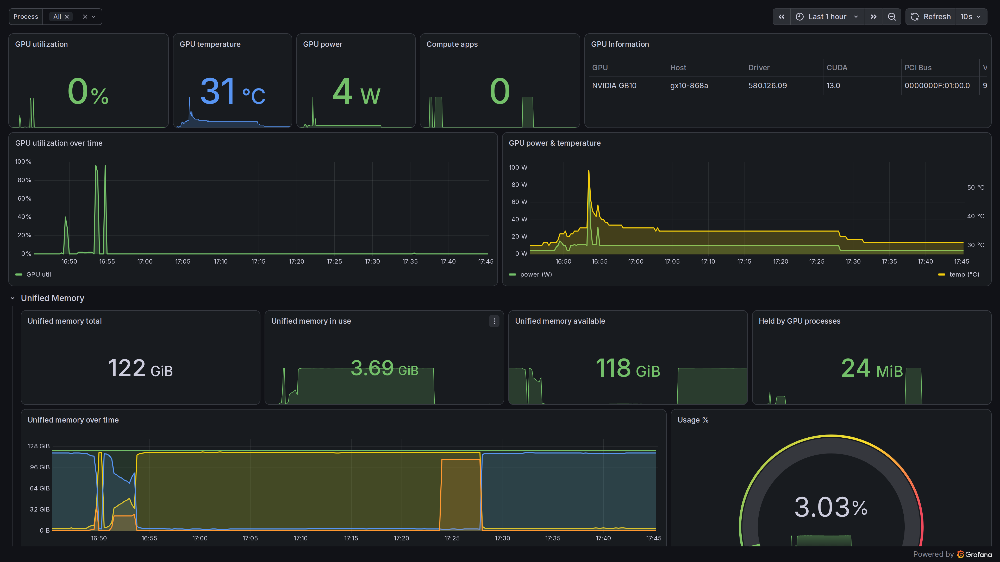

# DGX Spark Dashboard

A Docker Compose monitoring setup for the **NVIDIA DGX Spark (GB10)**. A single
Python collector reads GPU and memory stats and feeds them to Prometheus, which
Grafana visualizes in a dashboard.

## Why a custom collector?

The GB10 uses a unified-memory architecture. There is no separate VRAM chip, so
`nvidia-smi` reports memory as `N/A` and every CUDA allocation lives in the
host's ~130 GB system RAM. Standard GPU exporters have nothing useful to expose
for this, and a plain node exporter does not understand GPU processes either.

This project replaces both `nvidia-gpu-exporter` and `node-exporter` with one
small Python collector that:

- reads `/proc/meminfo` for unified-memory total, used and available
- parses the `nvidia-smi` process table to track per-process GPU memory
- reports GPU utilization, temperature, power draw and the compute-app count
- reads `/proc/stat`, `/proc/loadavg` and `/proc/cpuinfo` for host CPU usage,
  load average and CPU model/cores
- reports host system-RAM totals alongside the unified-memory view
- serves everything over HTTP as Prometheus `/metrics`, with no extra agents

The collector runs with the NVIDIA container runtime, so `nvidia-smi` works
inside the container and it can see host GPU workloads such as vLLM.

## Dashboard



Grafana provisions the dashboard automatically on first start. It covers GPU
usage and unified-memory across multiple panels, including a **GPU Information**
panel that shows static hardware details from `nvidia-smi` (model, host, driver,
CUDA version, PCI bus, VBIOS, compute capability, P-state and compute mode),
all sourced from the `dgx_gpu_info` metric. A **CPU & Memory** row shows host
CPU utilization, load average, CPU model/cores and system-RAM usage (sourced
from `dgx_cpu_*` and `dgx_memory_*`).

## Components

| Service | Port | Role |
|---|---|---|
| `dgx-collector` | 9273 | Custom unified-memory and nvidia-smi collector |
| `prometheus` | 9090 | Scrapes the collector every 10s |
| `grafana` | 3000 | Dashboard (provisioned automatically) |

## Metrics (`dgx_*`)

- `dgx_unified_memory_total_bytes`, `dgx_unified_memory_used_bytes`,
  `dgx_unified_memory_available_bytes`
- `dgx_unified_memory_gpu_used_bytes` (sum across all GPU process contexts)
- `dgx_unified_memory_process_used_bytes{pid,type,process_name}` (per process)
- `dgx_gpu_utilization_ratio`, `dgx_gpu_temperature_celsius`,
  `dgx_gpu_power_draw_watts`, `dgx_gpu_compute_apps`
- `dgx_gpu_info{name,driver,cuda,uuid,pci_bus_id,host,vbios,compute_cap,pstate,compute_mode}`
- `dgx_gpu_pstate`, `dgx_gpu_compute_mode`, `dgx_gpu_persistence_mode`
- `dgx_cpu_usage_ratio` (host CPU utilization [0..1])
- `dgx_cpu_count`, `dgx_cpu_info{model,arch,cores}`
- `dgx_load_average_1m`, `dgx_load_average_5m`, `dgx_load_average_15m`
- `dgx_memory_total_bytes`, `dgx_memory_used_bytes`, `dgx_memory_available_bytes`
- `dgx_memory_buffers_cached_bytes` (reclaimable buffers + page cache)
- `dgx_collect_success` (1 when the last collection succeeded)

## Quick start

```bash
docker compose up -d
docker compose ps
```

Then open:

- Grafana: http://localhost:3000 (admin / admin)
- Prometheus: http://localhost:9090

Grafana auto-provisions the Prometheus datasource and dashboard on first start.

> The collector needs `NVIDIA_DRIVER_CAPABILITIES=utility`, an NVIDIA device
> reservation, and the `/proc/meminfo` mount so it can read GPU and memory data.
> These are all configured in `docker-compose.yml`.

## Layout

```
docker-compose.yml                      # collector, prometheus, grafana
collector/dgx_collector.py              # the custom collector
prometheus/prometheus.yml               # scrape config
grafana/provisioning/                   # datasource and dashboard (auto-loaded)
  datasources/prometheus.yml
  dashboards/dashboards.yml
  dashboards/dgx-gpu-smi.json
docs/screenshot-dashboard.png           # dashboard screenshot (linked in README)
```